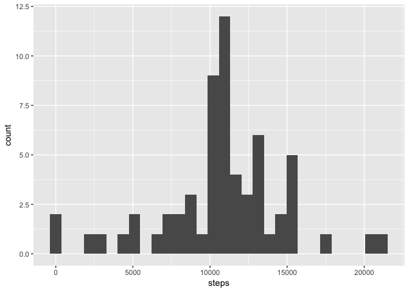

## Loading and preprocessing the data

```r
### Setting the working directory
setwd("~/Box/data_HD/_MyDocs/NIH-based grants/K99-R00/03_K99 awarded/Course work/01_Coursera/Course1_Data Science Specialization_John Hopkins U/Course5_Reproducible Research/coursework/week2/CourseProject1/git_files/RepData_PeerAssessment1")

### Loading packages
library(ggplot2)
library(dplyr)
library(gridExtra)
#####

#### Loading and preprocessing the data ####
df <- read.csv(unz("activity.zip", "activity.csv"), stringsAsFactors = FALSE)
### Converting date
df$date <- as.Date(df$date, "%Y-%m-%d")
###
```


## What is mean total number of steps taken per day?

```r
## Tibble with average steps per day
task1_df <- df %>% group_by(date) %>% summarise_at(vars("steps"), sum, na.rm=TRUE)
###
```
### Histogram of the total number of steps taken each day

```r
ggplot(task1_df, aes(x=steps)) + geom_histogram()
```

<!-- -->

### Mean and median number of steps taken each day
#### Mean 

```r
round(mean(task1_df$steps, na.rm = TRUE), 1)
```

```
## [1] 9354.2
```


#### Median

```r
round(median(task1_df$steps, na.rm = TRUE), 1)
```

```
## [1] 10395
```


## What is the average daily activity pattern?

```r
## Tibble with average number of steps taken per 5-min, averaged across all days
task2_df <- df %>% group_by(interval) %>% summarise_at(vars("steps"), mean, na.rm=TRUE)
```

### Time series plot of the average number of steps taken

```r
ggplot(data = task2_df, aes(x = interval, y = steps))+
    geom_line()
```

<!-- -->

#### The 5-minute interval that, on average, contains the maximum number of steps

```r
# Find index of max value for steps
rowindex_max <- as.numeric(which.max(task2_df$steps))
# Output 5-min interval matching the index above
task2_df$interval[rowindex_max]
```

```
## [1] 835
```


## Imputing missing values
### Code to describe and show a strategy for imputing missing data

```r
## Create a new dataset that is equal to the original dataset but with the missing data filled in
## Strategy: use the mean number of steps per 5-min interval to fill NA values in the respective 5-min interval
# Step 1: Loop to substitute the NA values for the respective mean steps within the 5-min interval
# loop index
index_loop <- 1
# Variable to hold filled missing data
steps_datfill <- NULL
# Loop
for (i in df$steps) {
    if (is.na(i)) { # value is NA
        # Variable with the interval
        interval <- df$interval[index_loop]
        # Index in task2_df$interval with same interval
        int_index <- which(task2_df$interval == interval)
        # Assigning the 5-min interval mean to the row in df$steps with NA value
        steps_datfill[index_loop] <- task2_df$steps[int_index]
    } else if (!is.na(i)) { # Value is NOT NA
        # Assigning the non-NA value
        steps_datfill[index_loop] <- df$steps[index_loop]
    }
    # Adding a unit to the loop index
    index_loop <- index_loop+1
}

# Step 2: Create new data set with data missing values filled
# Copying the original dataframe
df_filled <- df
# Substituting the column "steps" with the filled missing data
df_filled$steps <- steps_datfill

# Step 3: Make a histogram of the total number of steps taken each day and Calculate and report the mean and median total number of steps taken per day
## Tibble with average steps per day
task3_df <- df_filled %>% group_by(date) %>% summarise_at(vars("steps"), sum)
###
```


#### Total number of missing values in the dataset

```r
sum(is.na(df))
```

```
## [1] 2304
```


### Histogram of the total number of steps taken each day after missing values are imputed

```r
ggplot(task3_df, aes(x=steps)) + geom_histogram()
```

<!-- -->


### Mean and median number of steps taken each day after missing values are imputed
#### Mean 

```r
round(mean(task3_df$steps, na.rm = TRUE), 1)
```

```
## [1] 10766.2
```


#### Median

```r
round(median(task3_df$steps, na.rm = TRUE), 1)
```

```
## [1] 10766.2
```


These values DO differ from the estimates calculated before data imputation. The impact of imputing missing data on the estimates of the total daily number of steps is that: 1. it made the mean from imputed data to be greater than the mean with missing data; 2. after data imputation, both the mean and median are identical.


## Are there differences in activity patterns between weekdays and weekends?

```r
# Create a vector of weekdays
weekday_labels <- c('Monday', 'Tuesday', 'Wednesday', 'Thursday', 'Friday')

# Use `%in%` and `weekdays` to create a logical vector, and convert to `factor` and specify the `levels/labels`
df_filled$Week_Wkend <- factor((weekdays(df_filled$date) %in% weekday_labels), 
                               levels=c(FALSE, TRUE), labels=c('weekend', 'weekday'))

## Creating data frames for weekdays and weekends
# List with both data frames
list_df <- split(df_filled, df_filled$Week_Wkend)
# Data frames separate
df_filled_wkdays <- list_df[[2]]
df_filled_wkend <- list_df[[1]]

## Tibble with average number of steps taken per 5-min, averaged across weekdays
task4a_df <- df_filled_wkdays %>% group_by(interval) %>% summarise_at(vars("steps"), mean, na.rm = TRUE)
task4b_df <- df_filled_wkend %>% group_by(interval) %>% summarise_at(vars("steps"), mean, na.rm = TRUE)
#####
```


### Panel plot comparing the average number of steps taken per 5-minute interval across weekdays and weekends

```r
## Time series plot of the 5-minute interval (x-axis) and the average number of steps taken, averaged across all weekday days or weekend days (y-axis)
p_wkdays <- ggplot(data = task4a_df, aes(x = interval, y = steps)) + geom_line() + ggtitle("Weekdays") + ylim(0,250)
p_wkend <- ggplot(data = task4b_df, aes(x = interval, y = steps)) + geom_line()  + ggtitle("Weekend") + ylim(0,250)
 
# Plotting
grid.arrange(p_wkend, p_wkdays, ncol = 1)
```

<!-- -->
